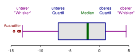

```{r setup, include=FALSE}
knitr::opts_chunk$set(echo = TRUE)
```

<style>
div.green {background-color: #ecffeb; border-radius: 5px; padding: 20px;}
</style>

# Preliminaries

## Setup

- Laden Sie die [Statistik-Software R](https://ftp.fau.de/cran/) herunter und installieren Sie sie. Die aktuellste Version ist `4.0.x`.

- Laden Sie außerdem [RStudio](https://rstudio.com/products/rstudio/download/#download) herunter und installieren Sie es.

- Schauen Sie sich ggf. diese [kurze Einführung in RStudio](https://www.youtube.com/watch?v=tyvEHQszZJs) an.

- Installieren Sie die folgenden Packages (und updaten Sie alle bislang installierten Packages, s. letzter Punkt in dieser Aufzählung):

```{r, eval = F}
install.packages(c("Rcpp", "rmarkdown", "gridExtra", "tidyverse", "rlang", "magrittr", "lme4", "lmerTest", "ez", "emmeans", "broom"), dependencies = T)
```

- Sollte der obige Befehl den Fehler `installation of package had non-zero exit status` werfen, hat die Installation nicht geklappt. Für Windows kann es sein, dass Sie in diesem Fall zusätzlich [Rtools](https://cran.r-project.org/bin/windows/Rtools/) installieren müssen. Für MacOS müssen Sie ggf. die *XCode command-line tools* installieren und/oder resetten. Öffnen Sie dafür ein Mac Terminal und führen Sie folgende Befehle aus:

```{bash, eval = F}
xcode-select --install
# Falls die Installation der R Packages dann immer noch nicht klappt:
xcode-select --reset
```

- Laden Sie anschließend die folgenden Packages:

```{r, warning = F, message = F}
library(tidyverse)
library(magrittr)
library(broom)
library(ez)
library(lmerTest)
library(emmeans)
```

- Bitte überprüfen Sie regelmäßig, ob Ihre Packages Updates benötigen -- die Updates werden in R nicht automatisch eingespielt! Klicken Sie hierfür in der Werkzeugleiste auf `Tools > Check for Package Updates`. Auch RStudio selbst erhält ab und zu Updates, dies können Sie überprüfen mit `Help > Check for Updates`. Sie sollten außerdem stets mit der neuesten R Version arbeiten, das ist derzeit `4.0.x` (Stand: 15. November 2020). Sie können Ihre R Version überprüfen mit `getRversion()`. Besuchen Sie einfach in regelmäßigen Abständen die [R Webseite](https://ftp.fau.de/cran/) und schauen Sie, ob eine neue stabile Version verfügbar ist.

## Arbeiten in einem Markdown-Dokument

R Markdown ist kein normales R Skript. Markdowns sind besonders sinnvoll für reproduzierbare Berichte, bei denen mehr Text als Code verwendet wird. Text kann im Markdown einfach geschrieben werden, Code wird in Code Snippets geschrieben und ausgeführt. Aus dem Markdown kann mittels des Buttons `Knit` in der kleinen Werkzeugleiste eine HTML, eine PDF oder ein Word Dokument erstellt werden. Beim "*knitten*" werden alle Sonderzeichen interpretiert und alle Code Snippets ausgeführt. **Versuchen Sie nun, dieses Dokument in eine HTML umzuwandeln!** 

Die Sonderzeichen werden für Textmarkierungen verwendet. Hier eine Auswahl der wichtigsten Zeichen:

\# Überschrift: Mit einem Hashtag bekommt man die größtmögliche Überschrift; je mehr Hashtags man benutzt, desto kleiner wird die Überschrift

Der Backslash ist übrigens das Escape Zeichen, mit dem man verhindert, dass ein Sonderzeichen beim *knitten* des Markdowns interpretiert wird. Stattdessen wird einfach das Zeichen wiedergegeben.

**fett**: Mit doppeltem Asterisk vor und hinter eine Textpassage wird der Text fett gesetzt.

*kursiv*: Mit einfachem Asterisk wird der Text kursiv.

`code`: die einfachen rückwärts gewandten Anführungszeichen heben den darin enthaltenen Text hervor; das wird üblicherweise für Code benutzt, wenn man sich außerhalb eines Code Snippets befindet; dieser Code kann aber nicht ausgeführt werden!

```: Die dreifachen rückwarts gewandten Anführungszeichen markieren den Anfang und das Ende eine Code Snippets (auch Code Block genannt). Dazwischen darf nur Code geschrieben werden; Text muss mit einem Hashtag als Kommentar verfasst werden. Am Anfang des Code Snippets wird außerdem in geschweiften Klammern angegeben, welche Programmiersprache man im Code Block schreibt (in unserem Fall: {r}).

Noch mehr Informationen finden Sie im [Cheatsheet zu R Markdown](https://www.rstudio.org/links/r_markdown_cheat_sheet).

## Hilfe zur Selbsthilfe

Es gibt eine sehr große und hilfsbereite R Community, die Ihnen das Programmieren mit R erleichtern wird. Hier ein paar gute Links und Befehle, falls Sie mal nicht weiter wissen:

- [Stack Overflow](https://stackoverflow.com/questions/tagged/r): Ein Blog, auf dem Sie höchstwahrscheinlich eine Antwort auf Ihre Frage zu R finden werden. Am einfachsten googlen Sie Ihre Frage auf Englisch; die Antwort eines Mitglieds von Stack Overflow wird bei den ersten Suchergebnissen dabei sein.

- [Hadley Wickham's "R for Data Science"](https://r4ds.had.co.nz/): Hadley Wickham ist der Chief Programmer des "tidyverse". Seine Bücher sind sehr verständlich, gut strukturiert und kurzweilig zu lesen.

- [Winston Chang's "Cookbook for R"](http://www.cookbook-r.com/Graphs/): Ein gutes Nachschlagewerk für `ggplot2`.

- Cheatsheets: Das sind PDFs, die eine Funktionsübersicht mit Erklärungen und ggf. Beispielen in absoluter Kurzform bieten. Sie finden einige Cheatsheets unter `Help > Cheatsheets`. Ansonsten kann man Cheatsheets auch googlen und findet dann z.B. [Data Wrangling with dplyr and tidyr](https://rstudio.com/wp-content/uploads/2015/02/data-wrangling-cheatsheet.pdf), das [Cheatsheet ggplot2](https://rstudio.com/wp-content/uploads/2015/03/ggplot2-cheatsheet.pdf) oder diese sehr ausführliche [Reference Card](https://cran.r-project.org/doc/contrib/Short-refcard.pdf).

- Vignetten: Zu einigen essentiellen Paketen gibt es so genannte "Vignetten", das sind meist HTMLs oder PDFs (erzeugt aus einem R Markdown), die die Autoren eines Pakets geschrieben haben. Sie können mit folgender Konsoleneingabe nach Vignetten suchen:

```{r, eval = F}
vignette()
# zum Beispiel zu einer Library aus dem tidyverse:
vignette("dplyr")
```

- In RStudio können Sie sich über die Eigenschaften einer Funktion informieren, indem Sie im Panel mit dem Tab `Help` die gewünschte Funktion ins Suchfeld eingeben. Sie erhalten dann u.a. Informationen über die Argumente der Funktion und Beispiele. Dasselbe erreichen Sie über diese Konsoleneingaben:

```{r, eval = F}
# zum Beispiel für die Funktion getwd():
?getwd
help("getwd")
```

# Statistik in R: Literatur

Wenn Sie mehr Informationen zu den Themen dieses Workshops benötigen, seien Ihnen folgende Werke ans Herz gelegt:

- Bodo Winter's "Statistics for Linguists: An Introduction using R": Ein frisch erschienenes Buch voller hervorragender Erklärungen zu allen wichtigen Themen der Inferenzstatistik. Derzeit nur als physisches Exemplar im Philologicum verfügbar.

- Stefan Gries' "Statistics for Linguistics with R: A Practical Introduction": Nützlich für die Entscheidungsfindung, welches statistische Modell zu den eigenen Daten und der eigenen Fragestellung passt. Da das Buch von 2009 ist, ist der Code z.T. veraltet, aber aus statistischer Sicht ist der Inhalt noch aktuell. Als Volltext über die Unibib verfügbar.

- Harald Baayen's "Analyzing Linguistic Data: A Practical Introduction to Statistics": Einführung für eher Fortgeschrittene. Hier ist der R Code ebenfalls oft veraltet, aber die Erklärungen und Beispiele zu den Statistikgrundlagen sind hilfreich. Als physisches Exemplar in der Unibib verfügbar.

# Empirische und theoretische Verteilungen

## Daten kennenlernen

### Deskriptive Werte

Um später den richtigen statistischen Test auswählen zu können, müssen Sie Ihre Daten kennen. Hierbei helfen vor allen Dingen Abbildungen und deskriptive Werte, wie (Gruppen-)Mittelwert, Median, Standardabweichung. Zunächst laden wir einen Data Frame, der die Dauer von Vokalen enthält:

```{r}
url <- "http://www.phonetik.uni-muenchen.de/~jmh/lehre/Rdf"
dauer <- read.table(file.path(url, "vdata.txt"))
head(dauer)
dim(dauer)
```

Nun berechnen wir ein paar deskriptive statistische Werte:

- **Minimum** und **Maximum**
- **Arithmetisches Mittel**: auch Mittelwert oder Durchschnitt genannt. Wird berechnet als die Summe aller Werte geteilt durch die Anzahl der Werte.
- **Median**: der mittlere Wert einer geordneten Zahlenreihe. Bei einer geraden Anzahl an Zahlen wird der Median aus dem Mittelwert der beiden mittleren Werten berechnet.
- **Standardabweichung**: ein Maß für die Streuung der Werte um den Mittelwert

```{r}
range(dauer$dur)
mean(dauer$dur)
median(dauer$dur)
sd(dauer$dur)
```

Natürlich können wir jeden dieser Werte auch pro Vokaltyp berechnen. Dazu benutzen wir `tidyverse`-Funktionen:

```{r}
dauer %>%
  group_by(V) %>%
  dplyr::summarise(mean = mean(dur),
                   median = median(dur),
                   sd = sd(dur),
                   min = min(dur),
                   max = max(dur))
```

### Boxplot

Als Abbildungen eignen sich grundsätzlich Scatterplots (bei zwei numerischen Variablen), Boxplots, Histogramme und die Wahrscheinlichkeitsdichteverteilung. All diese Plots lassen sich ganz einfach mit `ggplot2` erzeugen. Für die Dauerwerte fangen wir mit einem [Boxplot](https://de.wikipedia.org/wiki/Box-Plot) an. Ein Boxplot besteht aus folgenden Teilen:

{width=110%}

- **Median**: Der Strich innerhalb der Box ist der Median.
- **Box**: Die Box umfasst die mittleren 50% aller Datenpunkte. Das untere Ende der Box ist das erste Quartil Q1 (25% Perzentil), das obere Ende ist das dritte Quartil Q3 (75% Perzentil). Die Differenz zwischen Q1 und Q3 wird auch als **interquartiler Bereich** (*interquantile range*, IQR) bezeichnet.
- **Whiskers**: Die Whiskers erstrecken sich vom Q1 und vom Q3 aus zu dem niedrigsten/höchsten Datenpunkt, der innerhalb von `1.5 * IQR` liegt.
- **Punkte**: Ausreißer, also alle restlichen Datenpunkte, die nicht in der Box und den Whiskers enthalten sind.

Hier ist ein Boxplot der Dauer des Vokals /Y/ aus dem Data Frame `dauer`:

```{r}
dauer_y <- dauer %>% dplyr::filter(V == "Y")
ggplot(dauer_y) + 
  aes(x = V, y = dur) + 
  geom_boxplot() + 
  xlab("")
```

Nun versuchen wir die Werte im Boxplot nachzuvollziehen:

```{r}
Median <- median(dauer_y$dur)
Median
Q1 <- as.numeric(quantile(dauer_y$dur, 0.25))
Q1
Q3 <- as.numeric(quantile(dauer_y$dur, 0.75))
Q3
iqr <- IQR(dauer_y$dur)
iqr
# IQR = Länge der Box
iqr == as.numeric(Q3-Q1)
whisker_Q1 <- Q1 - 1.5 * iqr
whisker_Q1
whisker_Q3 <- Q3 + 1.5 * iqr
whisker_Q3
# Ende des unteren Whiskers
whisker_Q1_end <- dauer_y %>% dplyr::filter(dur > whisker_Q1 & dur < Q1) %>% dplyr::summarise(d = min(dur)) %>% pull(d)
whisker_Q1_end
# in diesem Fall stimmt folgendes:
whisker_Q1_end == min(dauer_y$dur)
# Ende des oberen Whiskers
whisker_Q3_end <- dauer_y %>% dplyr::filter(dur < whisker_Q3 & dur > Q3) %>% dplyr::summarise(d = max(dur)) %>% pull(d)
whisker_Q3_end
# hier sind der höchste Datenpunkt und der Ende des Whiskers nicht derselbe Punkt
whisker_Q3_end == max(dauer_y$dur)
outliers <- dauer_y %>% dplyr::filter(dur > whisker_Q3) %>% pull(dur)
outliers
```

### Histogramm

Eine andere Art der Abbildung ist das **Histogramm**. Das Histogramm gruppiert die Werte in sogenannten *bins* (Balken), die einen gewissen Wertebereich abdecken. Dann zeigt das Histogramm wie viele Datenpunkte (der *count*) in einem bestimmten Wertebereich liegen. Histogramme können dabei helfen zu erkennen, um welche Art von theoretischer Verteilung (Normalverteilung, Poisson-Verteilung, etc.) es sich bei den Daten handeln könnte.

```{r}
ggplot(dauer) + 
  aes(x = dur) + 
  geom_histogram(bins = 50, color = "white")
```

**Sonderfall Dauer**: Wie wir im Histogramm oben sehen können, steigt die Verteilung steil an und fällt dann langsamer ab (d.h. sie hat einen positiven Skew). Das ist ganz typisch für Dauer-Messungen und einige andere Arten von Werten, denn es gibt ein natürliches unteres Limit (eine Dauer kann nicht negativ sein) und kein Limit nach oben. Wenn dies bei Ihrer Verteilung der Fall ist, sollten Sie die Daten **logarithmieren** (und zwar nicht nur in der Abbildung, sondern auch bei der Statistik später!):

```{r}
dauer %<>% mutate(logDur = log(dur))
ggplot(dauer) + 
  aes(x = logDur) + 
  geom_histogram(bins = 50, color = "white")
```

### Wahrscheinlichkeitsdichte

Um aus einem Histogramm eine **Wahrscheinlichkeitsdichteverteilung** (*probability density*) zu machen, muss die y-Achse so verändert werden, dass die Fläche unter allen *bins* genau 1 ist. In `ggplot2` fügt man hierfür `y = ..density..` zu den *aesthetic mappings* hinzu.

```{r}
ggplot(dauer) + 
  aes(x = logDur, y = ..density..) + 
  geom_histogram(bins = 50, color = "white")
```

Die Wahrscheinlichkeitsdichte wird berechnet als `count / (N * Balkenbreite)`, wobei $N$ für die Anzahl der Beobachtungen im Datensatz steht. Am Beispiel vom höchsten Balken im obigen Histogramm können wir diese Rechnung beispielhaft durchführen: der *count* beträgt hier 175 und die Balkenbreite (*binwidth*) ist ca. 0.042. Dann ist die entsprechende Wahrscheinlichkeitsdichte für diesen Balken, den sie im obigen Density Plot ablesen können:

```{r}
density <- 175 / (nrow(dauer) * 0.042)
density
```

Die Fläche dieses Balkens ist `Balkenbreite * Balkenhöhe`, also:

```{r}
area <- 0.042 * density
area
```

Das heißt, dass ca. 5.9% aller Daten im Wertebereich dieses einen *bins* liegen. Wenn Sie die Fläche für jeden der *bins* berechnen und alles aufsummieren, kommen Sie genau auf 1. Wenn man nun für einen Datensatz unendliche viele unendlich schmale *bins* plotten würde, bekäme man die **Wahrscheinlichkeitsdichtefunktion** (*probability density function*). Für diese Funktion gilt ebenfalls, dass die Fläche darunter genau 1 ist. In `ggplot2` wird diese Funktion mit `geom_density()` gezeichnet:

```{r}
ggplot(dauer) + 
  aes(x = logDur) + 
  geom_density()
```

Wenn wir das Experiment nochmal durchführen würden, mit dem wir die Daten in `dauer` erhalten haben, dann könnten wir mittels der Wahrscheinlichkeitsdichtefunktion vorhersagen, mit welcher Wahrscheinlichkeit ein neuer Wert aus dem Experiment in einen bestimmten Wertebereich fällt. Hierzu gleich mehr.

## Normalverteilung

### Sind meine Daten normalverteilt?

In vielen empirischen Experimenten folgen die Daten einer Normalverteilung (auch Gauss-Verteilung genannt). Diese Verteilung lässt sich durch die zwei Parameter Mittelwert und Standardabweichung vollständig beschreiben. In `ggplot2` nutzen wir die Funktion `dnorm()`, die die entsprechenden zwei Argumente bekommt. Hier überlagern wir die obige Wahrscheinlichkeitsdichteverteilung von `dauer` mit der Normalverteilung (in blau), die durch den Mittelwert und die Standardabweichung der logarithmierten Dauerwerte beschrieben wird:

```{r}
ggplot(dauer) + 
  aes(x = logDur) + 
  geom_density() + 
  xlim(3.0, 7.0) + 
  stat_function(fun = dnorm, 
                args = list(mean = mean(dauer$logDur), sd = sd(dauer$logDur)), 
                inherit.aes = F, 
                color = "blue")
```

Hier sehen wir, dass die Normalverteilung genau symmetrisch um den Mittelwert `mean(dauer$logDur)` liegt, aber die empirische Verteilung leicht davon abweicht. Um zu testen, ob Daten normalverteilt sind, sind visuelle Methoden unter angewandten Statistikern und Statistikerinnen beliebter als statistische Tests. Neben der Überlagerung der Normalverteilung auf die empirische Verteilung werden häufig sogenannte **Q-Q-Plots** benutzt, wobei Q für **Quantil** (*quantile*) steht. Ein Quantil teilt eine Verteilung so auf, dass p% aller Datenpunkte unterhalb des Quantils liegen. Übrigens ist Quantil ein Überbegriff; je nachdem in wie viele Stücke man die 100% der Datenpunkte aufteilt, sagt man auch Perzentil (100 Stücke) oder **Quartil** (4 Stücke). Daher haben wir z.B. oben beim Boxplot vom ersten *Quartil* gesprochen, denn es handelt sich dabei um das *25%-Quantil*. Schauen Sie folgendes [YouTube-Video](https://www.youtube.com/watch?v=X9_ISJ0YpGw), um zu verstehen, wie ein Q-Q-Plot berechnet wird. Und lassen Sie sich nicht verwirren: Obwohl auf der y-Achse "*sample quantiles*" steht, sind das einfach nur die aufsteigend geordneten Datenpunkte!

```{r}
ggplot(dauer) + 
  aes(sample = logDur) + 
  stat_qq() + 
  stat_qq_line() + 
  ylab("samples") + 
  xlab("theoretical quantiles")
```

In `ggplot2` kann diese Abbildung mittels `stat_qq()` erstellt werden. Zusätzlich plotten wir mit `stat_qq_line()` eine gerade Linie, die wir zur Orientierung nutzen können. Wenn die Punkte von der Linie abweichen, sind die Daten nicht normalverteilt (wobei leichte Abweichungen am oberen und unteren Ende der Linie recht häufig sind). In diesem Fall ist ebenfalls eine leichte Abweichung von der Normalverteilung zu erkennen.

Zuletzt schauen wir uns noch den **Shapiro-Wilk Test** an, weil das der am häufigsten verwendete Test für Normalverteilungen ist. In R ist dazu die Funktion `shapiro.test()` gedacht, die als einziges Argument ihre Daten als Vektor bekommt:

```{r}
shapiro.test(dauer$logDur)
```

Die Null-Hypothese dieses Tests ist, dass die Daten tatsächlich normalverteilt sind. Wenn der **p-Wert** unter dem allgemein anerkannten Signifikanzniveau von $\alpha = 0.05$ liegt, müssen wir diese Hypothese ablehnen und daher davon ausgehen, dass die Daten nicht normalverteilt sind. Unsere logarithmierten Dauerwerte sind laut diesem Test also nicht normalverteilt. Für den Shapiro-Wilk Test sollte ihr Datensatz aus weniger als 5000 Beobachtungen bestehen und nicht zu viele Ausreißer oder identische Werte besitzen, da dies die Aussagekraft des Ergebnisses stark beeinflussen kann.

### Konfidenzintervall & 68–95–99.7 rule

Für Normalverteilungen (und in Annäherung auch für quasi-normalverteilte Daten) gilt die sogenannte 68–95–99.7 Regel. Wir illustrieren dies an einer Normalverteilung mit Mittelwert Null und Standardabweichung Eins:

```{r}
ggplot() +
  xlim(-4, 4) + 
  xlab("standard deviation") +
  ylab("probability density") + 
  geom_vline(xintercept = 0, lty = "dashed") + 
  stat_function(fun = dnorm, 
                args = list(mean = 0, sd = 1), 
                inherit.aes = F) + 
  stat_function(fun = dnorm, 
                args = list(mean = 0, sd = 1), 
                geom = "area", xlim = c(-1, 1), fill = "cornflowerblue", alpha = 0.5) +
  stat_function(fun = dnorm, 
                args = list(mean = 0, sd = 1), 
                geom = "area", xlim = c(-2, -1), fill = "violetred4", alpha = 0.5) + 
  stat_function(fun = dnorm, 
                args = list(mean = 0, sd = 1), 
                geom = "area", xlim = c(1, 2), fill = "violetred4", alpha = 0.5) + 
  stat_function(fun = dnorm, 
                args = list(mean = 0, sd = 1), 
                geom = "area", xlim = c(-3, -2), fill = "goldenrod", alpha = 0.5) + 
  stat_function(fun = dnorm, 
                args = list(mean = 0, sd = 1), 
                geom = "area", xlim = c(2, 3), fill = "goldenrod", alpha = 0.5) + 
  annotate(geom = "text", x = 0.5, y = 0.2, label = "0.34") + 
  annotate(geom = "text", x = -0.5, y = 0.2, label = "0.34") + 
  annotate(geom = "text", x = 1.5, y = 0.05, label = "0.135") + 
  annotate(geom = "text", x = -1.5, y = 0.05, label = "0.135") + 
  annotate(geom = "text", x = 2.3, y = 0.01, label = "0.02") + 
  annotate(geom = "text", x = -2.3, y = 0.01, label = "0.02")
```

Die Fläche unter der Normalverteilung ist 1, d.h. wir können mithilfe der Fläche bestimmen, mit welcher Wahrscheinlichkeit Datenpunkte in einen Wertebereich fallen. Bei der Normalverteilung fallen 68% der Daten in den blauen Bereich, 95% der Daten in den blauen + roten Bereich und 99.7% aller Daten in den gesamten eingefärbten Bereich. Dies entspricht dem Mittelwert $\mu$ $\pm1\sigma$, $\pm2\sigma$ und $\pm3\sigma$.

Die Fläche unter der Normalverteilung können wir mit `pnorm()` berechnen. Diese Funktion bekommt einen x-Wert und den Mittelwert und die Standardabweichung, die die Normalverteilung beschreiben (der *default* ist Null und Eins, deshalb lasse ich hier diese beiden Argumente weg). Dann berechnet `pnorm()` die Fläche von minus unendlich bis zu dem genannten x-Wert. Wenn wir einen ganz hohen x-Wert eintragen, sollte klar werden, dass die Fläche unter der Normalverteilung tatsächlich 1 ist:

```{r}
pnorm(100)
```

Für `x = 0` (also unseren Mittelwert) sollte die Fläche 0.5 betragen:

```{r}
pnorm(0)
```

Das heißt 50% aller Datenpunkte fallen in den Bereich von minus unendlich bis null. Nun können wir auch die oben eingefärbten Flächen berechnen:

```{r}
# blaue Flächen:
pnorm(0) - pnorm(-1)
pnorm(1) - pnorm(0)
# rote Flächen:
pnorm(-1) - pnorm(-2)
pnorm(2) - pnorm(1)
# gelbe Flächen:
pnorm(-2) - pnorm(-3)
pnorm(3) - pnorm(2)
```

In der Statistik interessieren wir uns häufig dafür, ob Daten in das **Konfidenzintervall** fallen, meist wird vom 95%-Konfidenzintervall gesprochen. Das heißt bei normalverteilten Daten prüfen wir, ob ein Datenpunkt in den Wertebereich $\mu \pm 2\sigma$ fällt. Um wiederum herauszufinden, welcher Wertebereich das genau ist, nutzen wir `qnorm()`, wieder Mittelwert und Standardabweichung als Argumente bekommt und zusätzlich die Fläche unter der Verteilung. Wenn wir symmetrisch um den Mittelwert eine Fläche von insgesamt 0.95 haben wollen, ist die Fläche am linken und rechten Rand der Verteilung jeweils $(1 - 0.95) / 2 = 0.025$. Für unsere Normalverteilung oben können wir dann berechnen:

```{r}
qnorm(0.025)
qnorm(1-0.025)
```

Das heißt für die Normalverteilung mit Mittelwert Null und Standardabweichung 1 liegt eine Fläche von 0.95 zwischen -1.96 und 1.96. Oben hatten wir gesagt, dass die Fläche von 0.95 aber $\mu \pm2\sigma$ entspricht -- genauer hätten wir schreiben müssen $\mu \pm 1.96\sigma$.

### Empirische Verteilung

```{r}
ice <- read.table(file.path(url, "ice.txt")) %>% 
  mutate(logDur = log(Dauer)) %>% 
  dplyr::filter(logDur < 5.2)
head(ice)
```

- Berechnen Sie für die empirisch erhobenen Dauerwerte in `ice$logDur` folgende Werte unter der Annahme, dass die Daten normalverteilt sind: Mittelwert, Standardabweichung, Minimum, Maximum, Median.

```{r}
# Platz zum Ausprobieren:

```

- Erstellen Sie für die logarithmierte Dauer einen Boxplot pro Konsonant (`ice$Stop`) sowie eine Wahrscheinlichkeitsverteilung:

```{r}
# Platz zum Ausprobieren:

```

- Schätzen Sie mittels visueller Methoden ab, ob die Daten einer Normalverteilung folgen.

```{r}
# Platz zum Ausprobieren:

```

- Berechnen Sie das 95%-Konfidenzintervall für die logarithmierte Dauer in `ice`:

```{r}
# Platz zum Ausprobieren:

```

- Mit welcher Wahrscheinlichkeit fallen Werte aus diesem Experiment in einen Wertebereich
  - unter 4.0?
  - über 5.0?
  - zwischen 4.0 und 4.5?

```{r}
# Platz zum Ausprobieren:

```


## Population und Stichprobe

Eine Population oder Grundgesamtheit ist im statistischen Sinne die Menge aller Einheiten (d.h. Personen, Wörter, etc.), die in bestimmten Identifikationskriterien (z.B. Geschlecht, Herkunft, grammatikalische Funktion, etc.) übereinstimmen. Stellen Sie sich z.B. vor, Sie möchten die durchschnittliche Grundfrequenz (F0) aller Frauen in Deutschland erfassen. Dann ist Ihre Population die Menge aller Frauen in Deutschland, also ca. 40 Mio. Menschen. Den Populationsmittelwert $\mu$ (sprich: /myː/, geschrieben oft: mu) können Sie in diesem Beispiel nur ermitteln, indem Sie zu jeder einzelnen Frau in Deutschland fahren und deren Grundfrequenz messen, was natürlich schon rein wirtschaftlich unmöglich ist. 

Stattdessen erhebt man in der Wissenschaft meist Stichproben (*samples*), also z.B. nur einen Teil der weiblichen Bevölkerung, und geht davon aus, dass der so erhaltene Stichprobenmittelwert $m$ nicht allzu weit weg ist vom tatsächlichen Populationsmittelwert $\mu$. Je größer die Stichprobe ist, desto mehr wird sich deren Mittelwert $m$ und Standardabweichung $s$ dem tatsächlichen Populationsmittelwert $\mu$ und der Populationsstandardabweichung $\sigma$ annähern. Für die Merkmale einer Population werden im Normalfall griechische Symbole verwendet, für die Merkmale einer empirisch erhobenen Verteilung (d.h. einer Stichprobe) werden römische Buchstaben benutzt.

Die Methoden der **Inferenzstatistik** ermöglichen uns Rückschlüsse von der Stichprobe auf die Population. Genauer gesagt: die Inferenzstatistik hilft uns dabei, die Parameter der Population zu **schätzen**. Es gibt auch Maße wie z.B. den Standard Error, die beschreiben wie gut oder schlecht die Schätzung ist.

# Einfache lineare Regression

Bisher haben wir uns mithilfe der deskriptiven Statistik eine Variable (nämlich die Dauer von Sprachlauten) genauer angeschaut und einiges über die deren Verteilung erfahren. Häufig stehen solche Variablen jedoch in Abhängigkeit zu anderen Variablen. Zum Beispiel ist durch viele Studien belegt worden, dass unsere Reaktionsfähigkeit mit steigendem Schlafmangel abnimmt. Das heißt, dass die durchschnittliche Reaktionszeit von der Variable Schlafmangel abhängig ist. Wir sprechen deshalb auch von abhängigen und unabhängigen Variablen. Mit der einfachen linearen Regression lassen sich diese Abhängigkeiten beschreiben. Oft wird auch davon gesprochen, dass man den Wert der abhängigen Variable $y$ durch die unabhängige Variable $x$ vorhersagt. Bevor wir eine lineare Regression durchführen, sprechen wir über Regressionslinien und Korrelation.

## Die Regressionslinie

In der linearen Regression ist die Regressionslinie, naja, eben linear. Das bedeutet, sie lässt sich mit folgender Formel beschreiben:

$y = k + bx$

Hierbei ist $k$ der y-Achsenabschnitt (**intercept**) und $b$ die Steigung (**slope**). Weil Intercept und Slope eine Regressionslinie eindeutig beschreiben, nennt man die beiden Parameter auch Regressionskoeffizienten. Durch die oben gegebene Formel lassen sich bei bekanntem Intercept $k$ und Slope $b$ also für alle möglichen $x$-Werte auch die entsprechenden $y$-Werte vorhersagen.

In der folgenden Abbildung sehen Sie drei Regressionslinien: blau und grün haben dasselbe Intercept, aber entgegengesetzte Slopes; blau und orange haben unterschiedliche Intercepts, aber die gleiche Slope. Der genaue Wert der Steigung gibt an, um wie viel der $y$-Wert steigt oder sinkt, wenn man um eine $x$-Einheit erhöht. Für $x = 0$ in der Abbildung oben ist $y = 1$ (für blau und grün). Für $x = 1$ ist $y = 1 + b$, also für blau $y = 1 + 0.5 = 1.5$ und für grün $y = 1 + (-0.5) = 0.5$. Für die orange Linie gilt bei $x = 0$ ist $y = 2$, bei $x = 1$ ist $y = 2 + 0.5 = 2.5$.

```{r}
ggplot() + 
  xlim(-2, 2) + ylim(-2, 4) + xlab("x") + ylab("y") +
  geom_abline(slope = 0.5, intercept = 1, color = "blue") + 
  geom_abline(slope = -0.5, intercept = 1, color = "darkgreen") + 
  geom_abline(slope = 0.5, intercept = 2, color = "orange") + 
  geom_vline(xintercept = 0, lty = "dashed")
```

Zusammengefasst beschreiben die blaue und orange Linie also eine positive Korrelation zwischen $x$ und $y$ (je größer $x$, desto größer $y$), die grüne Linie beschreibt eine negative Korrelation (je größer $x$, desto kleiner $y$).

**Achtung: Correlation is not causation!** Die lineare Regression kann nur die Korrelation zwischen zwei Variablen beschreiben, nicht aber die Kausalität. Die Kausalität bringen wir mit unserem Wissen ins Spiel. Wir wissen also zum Beispiel, dass es der Schlafmangel ist, der eine langsamere Reaktionszeit verursacht. Die lineare Regression könnte nur zeigen, ob eine Beziehung zwischen Reaktionszeit und Schlafmangel besteht, aber genauso gut könnte das aus Sicht der Regression bedeuten, dass eine langsamere Reaktionszeit Schlafmangel verursacht.

## Korrelation

Apropos Korrelation. Die Korrelation berechnen wir als *Pearson's correlation* $r$ mit der Funktion `cor()`. In diesem Kapitel werden wir mit den Data Frame `queen` arbeiten:

```{r}
queen <- read.table(file.path(url, "queen.txt"))
head(queen)
```

Darin sind die durchschnittlichen Grundfrequenzwerte von Queen Elizabeth II. bei ihren jährlichen Weihnachtsansprachen festgehalten. Uns interessiert, ob das Alter der Queen einen Einfluss auf ihre Grundfrequenz hat. Erstmal machen wir uns ein Bild von der Lage:

```{r}
ggplot(queen) + 
  aes(x = Alter, y = f0) + 
  geom_point()
```

Es sieht so aus, als ob es da einen Zusammenhang geben könnte: Je älter die Queen wird, desto mehr sinkt ihre Grundfrequenz! Unseren visuellen Eindruck können wir anhand der Korrelation $r$ überprüfen:

```{r}
cor(queen$Alter, queen$f0)
```

Die Korrelation $r$ nimmt ausschließlich Werte zwischen -1 und 1 an. Mit -0.84 liegt eine starke negative Korrelation vor, d.h. unser visueller Eindruck scheint zu stimmen.

## Lineare Regression mit `lm()`

Nun sind wir bereit, eine lineare Regression durchzuführen. Die lineare Regression schätzt Intercept und Slope so ein, dass eine Regressionslinie durch die Datenpunkte gelegt werden kann, die den kleinstmöglichen Abstand zu allen Punkten hat. So sieht sie Regressionslinie in Fall der Queen aus:

```{r}
ggplot(queen) + 
  aes(x = Alter, y = f0) + 
  geom_point() + 
  geom_smooth(method = "lm", se = F, color = "blue")
```

In `ggplot2` wird hierfür meist die Funktion `geom_smooth(method = "lm")` verwendet. Das benutzt intern die Funktion `lm()`, um die Regressionskoeffizienten zu schätzen. Diese Funktion bekommt wiederum als Argumente nur eine Formel und den Data Frame. Die Formel lautet `y ~ x`, d.h. wir wollen die $y$-Werte (die Grundfrequenz) in Abhängigkeit von den $x$-Werten (dem Alter) vorhersagen.

```{r}
queen.lm <- lm(f0 ~ Alter, data = queen)
queen.lm
```

Die Koeffizienten lassen sich separat auch mit `coef()` ausgeben:

```{r}
coef(queen.lm)
```

Wir sehen also, dass das geschätzte Intercept bei 288.2 liegt und die Steigung bei -1.07. Die Steigung wird leider verwirrenderweise immer wie die $x$-Variable genannt, in diesem Fall also "Alter". Die Koeffizienten bedeuten folgendes: Bei einem Alter von Null Jahren ($x = 0$) liegt die Grundfrequenz wahrscheinlich bei ca. 288 Hz. Mit jeden weiteren Jahr ($x$ wird um 1 erhöht) sinkt die Grundfrequenz um 1.07 Hz. Indem wir Intercept und Slope in unsere Formel von vorhin einsetzen, können wir nun für alle möglichen Alter die entsprechende Grundfrequenz vorhersagen:

```{r}
x <- c(0, 40, 50)
f0_fitted <- coef(queen.lm)[1] + coef(queen.lm)[2] * x
f0_fitted
```

Bei einem Alter von Null Jahren lag die geschätzte Grundfrequenz der Queen wie schon gesagt bei 288 Hz. Bei einem Alter von 40 Jahren waren es vermutlich schon nur noch 245 Hz, bei 50 Jahren 234.5 Hz. Wie Sie sehen, lassen sich anhand des von uns "gefitteten Modells" auch $y$-Werte vorhersagen bzw. schätzen, die nicht im originalen Datensatz enthalten waren (wie z.B. den f0-Wert für die 50-jährige Queen). Alle diese Punkte liegen aber genau auf der Regressionslinie und da die Regressionslinie unendlich lang ist, ergibt die Schätzung nicht zwangsläufig für alle Werte Sinn. Halten Sie es beispielsweise für wahrscheinlich, dass die Grundfrequenz der Queen bei ihrer Geburt bei 288 Hz lag? Normalerweise haben Kinder eine Grundfrequenz von 300 bis 400 Hz. Sie müssen für Ihre Daten immer wissen, ob die Schätzungen sinnvoll sind oder nicht. In R können Sie die Schätzungen mit der Funktion `predict()` durchführen, die als Argumente das Modell `queen.lm` und einen Data Frame mit den $x$-Werten bekommt, für die $y$ geschätzt werden soll. Dabei muss die $x$-Variable genauso heißen wie in dem ursprünglichen Data Frame, also hier "Alter":

```{r}
predict(queen.lm, data.frame(Alter = seq(0, 100, by = 10)))
```

## Residuals

Wir sehen oben den geschätzten $y$-Wert für $x = 40$, also den Grundfrequenzwert für die Queen mit 40 Jahren, nämlich ca. 245 Hz. Der tatsächlich gemessene Wert liegt aber weit darunter:

```{r}
queen %>% filter(Alter == 40) %>% pull(f0)
```

Die Differenzen zwischen den geschätzten und gemessenen $y$-Werten werden **Residuals** genannt. Die folgende Abbildung zeigt einen Ausschnitt aus dem vorherigen Plot für die Altersspanne zwischen 30 und 40 Jahren. Die schwarzen Punkte sind die tatsächlich gemessenen f0-Werte, die roten Punkte hingegen sind die geschätzten Werte. Sie liegen genau auf der blauen Regressionslinie (die wir diesmal, weil wir ja Intercept und Steigung kennen, mit `geom_abline()` gezeichnet haben). Die vertikalen gestrichelten Linien stellen die Residuals dar. Diese Abbildung verdeutlicht, weshalb Residuals auch als **Error** bezeichnet werden.

```{r}
alter <- queen %>% filter(Alter > 30 & Alter < 41) %>% pull(Alter)
queen_fitted <- data.frame(Alter = alter,
                           f0 = predict(queen.lm, data.frame(Alter = alter)))
ggplot(queen %>% filter(Alter > 30 & Alter < 41)) +
  aes(x = Alter, y = f0) + 
  geom_point(size = 4) + 
  geom_abline(slope = coef(queen.lm)[2], intercept = coef(queen.lm)[1], color = "blue") + 
  geom_point(data = queen_fitted, color = "red", size = 4) + 
  geom_segment(aes(x = 31, y = 261.5, xend = 31, yend = 254.9), lty = "dashed") + 
  geom_segment(aes(x = 32, y = 259.6, xend = 32, yend = 253.8), lty = "dashed") + 
  geom_segment(aes(x = 33, y = 248.9, xend = 33, yend = 252.8), lty = "dashed") + 
  geom_segment(aes(x = 34, y = 257.0, xend = 34, yend = 251.7), lty = "dashed") + 
  geom_segment(aes(x = 35, y = 243.0, xend = 35, yend = 250.6), lty = "dashed") + 
  geom_segment(aes(x = 37, y = 235.5, xend = 37, yend = 248.5), lty = "dashed") + 
  geom_segment(aes(x = 38, y = 224.8, xend = 38, yend = 247.4), lty = "dashed") + 
  geom_segment(aes(x = 39, y = 237.6, xend = 39, yend = 246.3), lty = "dashed") + 
  geom_segment(aes(x = 40, y = 228.7, xend = 40, yend = 245.2), lty = "dashed")
```

Der Abstand zwischen den tatsächlichen und geschätzten Werten wird berechnet als die Summe über die quadrierten Residuals und heißt deshalb auch **sum of squares of error** (SSE). Das Verfahren, mit dem die Parameter der Regressionslinie geschätzt werden, heißt **least squares**, weil es versucht, die SSE so klein wie möglich zuhalten. Das führt dazu, dass die Regressionslinie so durch die Daten gelegt wird, dass alle Datenpunkte so nah wie möglich an der Linie sind.

Die Residuals können mit `resid()` ausgegeben werden:

```{r}
resid(queen.lm)
```

SSE kann mit `deviance()` berechnet werden:

```{r}
deviance(queen.lm)
```

## Annahmen überprüfen

Statistische Modelle wie die lineare Regression basieren auf Annahmen bezüglich der Daten, die erfüllt sein müssen, damit das Ergebnis des Modells überhaupt aussagekräftig ist. Im Falle der linearen Regression beziehen sich die Annahmen auf die Residuals.

### Normalität der Residuals

Die erste Annahme ist, dass die Residuals normalverteilt sind. Wir überprüfen das mit einem Q-Q-Plot:

```{r}
ggplot(augment(queen.lm)) + 
  aes(sample = .resid) + 
  stat_qq() + 
  stat_qq_line() + 
  ylab("samples") + 
  xlab("theoretical quantiles")
```

Das sieht okay, aber nicht perfekt aus. Wir erstellen noch eine Wahrscheinlichkeitsverteilung mit überlagerter Normalverteilung:

```{r}
ggplot(augment(queen.lm)) + 
  aes(x = .resid) + 
  geom_density() + 
  xlim(-40, 40) + 
  xlab("residuals")
  stat_function(fun = dnorm, 
                args = list(mean = mean(augment(queen.lm)$.resid), sd = sd(augment(queen.lm)$.resid)), 
                inherit.aes = F, 
                color = "blue")
```

Wenn wir uns jetzt immer noch unschlüssig sind, können wir noch einen Shapiro-Wilk Test durchführen:

```{r}
shapiro.test(augment(queen.lm)$.resid)
```

Da der p-Wert hier höher ist als $\alpha = 0.05$, scheinen die Residuals normalverteilt zu sein.

### Konstante Varianz der Residuals

Die zweite Annahme besagt, dass die Varianz der Residuals für alle geschätzten Werte ähnlich sein sollte. Diese Annahme hat auch den schönen Namen **Homoskedastizität**. Wenn die Annahme nicht erfüllt wird, spricht man von **Heteroskedastizität**. Um die Varianz visuell darzustellen, plotten wir die Residuals gegen die geschätzten Werte. Da der Mittelwert der Residuals immer bei ungefähr Null liegt (gestrichelte Linie in der Abbildung bei $y = 0$), können wir die konstante Varianz daran erkennen, dass sich die Punkte gleichmäßig um diesen Mittelwert verteilen.

```{r}
ggplot(augment(queen.lm)) + 
  aes(x = .fitted, y = .resid) + 
  geom_point() +
  xlab("geschätzte f0-Werte") + 
  ylab("Residuals") + 
  geom_hline(yintercept = 0, lty = "dashed")
```

Da wir hier nur sehr wenige Datenpunkte haben, ist es schwierig einzuschätzen, ob es in dem Plot ein erkennbares Muster gibt, das darauf hinweisen würde, dass die Errors keine konstante Varianz hätten. Die zwei Ausreißer oben rechts sind jedenfalls kein gutes Zeichen, der Rest sieht okay aus. Um Ihre Intuition dafür zu schulen, was gute und schlechte Residual Plots sind, empfehle ich die Abbildungen 6.2 und 6.3 in Winter (2020) (s. [Kapitel 2](#statistik-in-r-literatur)).

## Alle Ergebnisse von `lm()` verstehen

### Geschätzte y-Werte und Residuals

Wie Sie vielleicht bemerkt haben, habe ich die Funktion `augment()` benutzt, um die Ergebnisse des linearen Modells in `ggplot2` nutzen zu können. Diese Funktion stammt aus dem Paket [`broom`](https://cran.r-project.org/web/packages/broom/vignettes/broom.html), das wir anfangs geladen haben und das noch zwei weitere hilfreiche Funktionen bereitstellt: `tidy()` und `glance()`. Das Ergebnis dieser Funktionen ist immer eine `tibble`, also ein Objekt, das wir easy weiterverarbeiten können (im Gegensatz zu den seltsamen Regressionsobjekten):

```{r}
class(queen.lm)
class(augment(queen.lm))
```

Schauen wir uns zuerst an, was `augment()` macht:

```{r}
augment(queen.lm)
```

Diese Funktion hängt an die originalen Daten (Spalten `f0` und `Alter`) weitere Spalten an, nämlich die gefitteten (also die vom Modell geschätzten) f0-Werte `.fitted`, die Residuals `.resid`, und weitere, die erstmal nicht interessant für uns sind.

### Regressionskoeffizienten und t-Statistik

Die Funktion `tidy()` gibt eine Tabelle für die geschätzten Regressionskoeffizienten zurück:

```{r}
tidy(queen.lm)
```

Sie erkennen hier die Spalte `estimate` wieder: diese enthält die Schätzungen für Intercept (erste Zeile) und Slope (zweite Zeile). Die Spalte `std.error` enthält den sogenannten **Standard Error**, ein Maß für die Genauigkeit der Schätzung. Hier wollen wir möglichst kleine Werte (in Relation zum Estimate), weil das bedeutet, das die Schätzungen des Modells für die Regressionskoeffizienten präzise sind. Es folgt eine Spalte mit der Teststatistik `statistic`. Bisher haben wir noch nicht über die statistische Signifikanz der Regression gesprochen. Hier wird ein **t-Test** durchgeführt, um herauszufinden, ob die Schätzungen der Regressionskoeffizienten signifikant von Null abweichen. Wenn die Regressionskoeffizienten nahe Null sind, tragen sie nichts dazu bei, den $y$-Wert vorherzusagen (erinnern Sie sich an die Formel für die Regressionslinie: Wenn $k$ oder $b$ gleich Null sind, haben sie keinen Einfluss auf die Regressionslinie). Der Wert in der Spalte `statistic`, der in diesem Fall auch **t-Wert** genannt wird, wird berechnet als `estimate / std.error`, so z.B. für die Slope:

```{r}
as.numeric(tidy(queen.lm)[2, "estimate"] / tidy(queen.lm)[2, "std.error"])
```

Die $t$-Statistik hat ihre eigene Wahrscheinlichkeitsdichteverteilung, die wir mit der Funktion `dt()` in `ggplot2` zeichnen lassen können. Diese Funktion bekommt ein Argument namens `df`, das steht für **degrees of freedom** (Freiheitsgrade). Die Freiheitsgrade sind hier üblicherweise die Größe der Stichprobe minus die Anzahl der Koeffizienten, also hier `nrow(queen) - 2`.

```{r}
ggplot() +
  xlim(-5, 5) +
  stat_function(fun = dnorm) +
  stat_function(fun = dt, args = list(df = 28), col = "orange") +
  stat_function(fun = dt, args = list(df = 5), col = "darkgreen") +
  xlab("") + ylab("density")
```

Hier sehen Sie die t-Verteilung in orange gegen die schwarze Normalverteilung mit Mittelwert Null und Standardabweichung Eins; die beiden Verteilungen sind sich sehr ähnlich. Mit abnehmenden Freiheitsgeraden (zum Beispiel 5 Freiheitsgrade bei der dunkelgrünen Verteilung) werden sich die Normal- und t-Verteilung unähnlicher. Wie Sie wissen, ist die Fläche unter diesen Verteilungen immer 1, d.h. auch bei der t-Verteilung können wir mittels einer Funktion berechnen, wie groß die Wahrscheinlichkeit ist, dass ein Wert in einen bestimmten Wertebereich fällt. In Anlehnung an `qnorm()` heißt die Funktion für die t-Verteilung `qt()`. So können wir unter Einsatz des t-Werts und der Freiheitsgrade den p-Wert berechnen (hier wieder für die Slope):

```{r}
2 * pt(abs(-8.016248), df = 28, lower.tail = F)
```

**Tipp**: Die wissenschaftliche Notation können Sie mit `format(scientific = F)` ausschreiben lassen (aber Achtung: das Ergebnis ist dann ein Schriftzeichenobjekt, keine Zahl):

```{r}
format(9.929356e-09, scientific = F)
```

Der p-Wert kann hier wie folgt interpretiert werden: Wenn wir davon ausgehen, dass die tatsächliche Slope Null ist (das ist die Null-Hypothese), dann ist die hier beobachtete Steigung von -1.074 höchst unerwartet.

### Gütekriterien für das Modell und F-Statistik

Nun, da wir die Ausgabe von `tidy()` verstehen, bleibt nur noch `glance()`. Die Funktion `glance()` zeigt auf einen Blick ein paar Kriterien, mit denen man die Güte des Modells einschätzen kann:

```{r}
glance(queen.lm)
```

Der Wert `r.squared` ist genau das, was der Name sagt: der quadrierte Korrelationswert $r$, den wir oben mit `cor()` berechnet hatten:

```{r}
cor(queen$Alter, queen$f0)^2
```

**$R^2$** beschreibt die Proportion der Varianz in den Daten, die von dem berechneten Modell beschrieben wird. Hier wird also ca. 70% der Varianz in den Daten durch das Modell mit einem Prädiktor (einer unabhängigen Variable) beschrieben. In der Linguistik sind viel niedrigere $R^2$-Werte üblicher, weil unser Untersuchungsgegenstand häufig von vielen zufälligen Faktoren beeinflusst wird, die wir nicht erfassen können. Der Wert `adj.r.squared` ist eine Form des $R^2$, die für die Anzahl der unabhängigen Variablen normalisiert, denn je mehr unabhängige Variablen im Modell sind, desto höher wird $R^2$ automatisch (aber eben nicht wegen der erklärenden Kraft der Variablen). Da es hier nur eine Variable gibt, sind sich $R^2$ und *adjusted* $R^2$ sehr ähnlich.

Die Spalte `sigma` enthält den **Residual Standard Error**, d.h. eine Schätzung für die Standardabweichung der Fehlerverteilung. Diesen Wert können wir mit `sigma()` berechnen:

```{r}
sigma(queen.lm)
```

Dann sehen wir wieder eine `statistic` samt `p.value`. Hier handelt es sich um eine **$F$-Statistik**, d.h. diesmal lesen wir den p-Wert aus der F-Verteilung ab, die mit `df()` in `ggplot2` gezeichnet werden kann. Diese Verteilung ist von zwei Parametern abhängig, nämlich `glance(queen.lm)$df` und `glance(queen.lm)$df.residual`. Dies sind die Freiheitsgrade für das Modell und für die Residuals. In orange sehen Sie wieder die F-Verteilung, die zu unseren Daten passt (nämlich mit einem Freiheitsgrad für das Modell und 28 Freiheitsgraden für die Residuals). Die Verteilung kann nur Werte größer als Null annehmen. In dunkelgrün sehen Sie eine Verteilung, bei der die Freiheitsgrade für das Modell verändert wurden, und in schwarz die Normalverteilung.

```{r}
ggplot(data.frame(x = 0:5)) +
  aes(x) +
  stat_function(fun = dnorm) +
  stat_function(fun = df, args = list(df1 = 1, df2 = 28), col = "orange") +
  stat_function(fun = df, args = list(df1 = 7, df2 = 28), col = "darkgreen") +
  xlab("") + ylab("density")
```

Wenn wir uns hier die orange Verteilung anschauen, sehen wir schon, dass ein $F$-Wert von 64.3 (s. `statistic`) extrem unwahrscheinlich wäre, daher ist der p-Wert auch sehr klein. Die Null-Hypothese im F-Test, der hier ausgeführt wurde, lautet, dass ein Modell ohne Prädiktoren die Daten genauso gut oder besser erklärt, als das Modell mit dem Prädiktor `Alter`. Das heißt, wenn der p-Wert, der aus dem F-Test resultiert sehr klein ist, können wir daraus schließen, dass unser Modell mit der unabhängigen Variable `Alter` die Daten besser erklärt, als ein Modell ohne Prädiktoren.

Wir versuchen nun die Werte in den Spalten `statistic`, `df`, `df.residual` und `deviance` nachzuvollziehen. Letzteren kennen Sie schon unter dem Namen **SSE** (*sum of squared error*): 

```{r}
SSE <- deviance(queen.lm)
SSE
```

`df` ist wie bereits angedeutet die Anzahl der Freiheitsgrade des Modells und wird berechnet als die Anzahl der Regressionskoeffizienten $k$ minus 1:

```{r}
k <- length(queen.lm$coefficients)
df.SSR <- k-1
df.SSR
```

`df.residual` ist die Anzahl der Freiheitsgrade der Residuals, die als die Anzahl der Beobachtungen $N$ minus die Anzahl der Regressionskoeffizienten $k$ berechnet wird. Wie Sie am Variablennamen `df.SSE` sehen können

```{r}
N <- nrow(queen)
df.SSE <- N-k
df.SSE
```

Um zuletzt noch den $F$-Wert in der Spalte `statistic` nachvollziehen zu können, schauen wir uns die Formel dafür an: $F = \frac{MSR}{MSE}$. Hierbei steht **MSR** für *mean squares of regression* und **MSE** für *mean squares of error*. Diese beiden Werte beschreiben die Varianz der geschätzten y-Werte und die Varianz der Residuals. Um MSE und MSR berechnen zu können, müssen wir zuerst zwei andere Werte berechnen: *sum of squares of Y* (**SSY**), die den Abstand der Datenpunkte zum Mittelwert von $y$ beschreibt, und *sum of squares of regression* (**SSR**), die den Unterschied zwischen SSY und SSR beschreibt. Zuerst SSY:

```{r}
SSY <- sum((queen$f0 - mean(queen$f0))^2)
SSY
```

In der Praxis ist SSY die Summe aller Abstände zwischen den schwarzen (tatsächlich gemessenen) Datenpunkten und der orangen Linie, die die y-Achse bei `mean(queen$f0)` schneidet und eine Steigung von Null hat (diese Abbildung zeigt wieder nur einen Ausschnitt aus dem gesamten Wertebereich):

```{r}
alter <- queen %>% filter(Alter > 30 & Alter < 41) %>% pull(Alter)
queen_fitted <- data.frame(Alter = alter,
                           f0 = predict(queen.lm, data.frame(Alter = alter)))
ggplot(queen %>% filter(Alter > 30 & Alter < 41)) +
  aes(x = Alter, y = f0) + 
  geom_point(size = 4) + 
  geom_abline(slope = coef(queen.lm)[2], intercept = coef(queen.lm)[1], color = "blue") + 
  geom_abline(slope = 0, intercept = mean(queen$f0), color = "orange") + 
  geom_point(data = queen_fitted, color = "red", size = 4) + 
  geom_segment(aes(x = 31, y = 261.5, xend = 31, yend = 254.9), lty = "dashed") + 
  geom_segment(aes(x = 32, y = 259.6, xend = 32, yend = 253.8), lty = "dashed") + 
  geom_segment(aes(x = 33, y = 248.9, xend = 33, yend = 252.8), lty = "dashed") + 
  geom_segment(aes(x = 34, y = 257.0, xend = 34, yend = 251.7), lty = "dashed") + 
  geom_segment(aes(x = 35, y = 243.0, xend = 35, yend = 250.6), lty = "dashed") + 
  geom_segment(aes(x = 37, y = 235.5, xend = 37, yend = 248.5), lty = "dashed") + 
  geom_segment(aes(x = 38, y = 224.8, xend = 38, yend = 247.4), lty = "dashed") + 
  geom_segment(aes(x = 39, y = 237.6, xend = 39, yend = 246.3), lty = "dashed") + 
  geom_segment(aes(x = 40, y = 228.7, xend = 40, yend = 245.2), lty = "dashed")
```

Sie können hier schon rein visuell sehen, dass die orange Linie die Daten viel schlechter beschreibt als die blaue Regressionslinie, deshalb ist SSY auch viel größer als SSE.

Für SSR müssen wir nun nur noch die Differenz von SSY und SSE bilden:

```{r}
SSR <- SSY - SSE
SSR
```

Nun können wir endlich MSE und MSR berechnen:

```{r}
MSE <- SSE/df.SSE
MSE
MSR <- SSR/df.SSR
MSR
```

...Und aus der Division von MSE und MSR entsteht der $F$-Wert:

```{r}
F_wert <- MSR / MSE
F_wert
```

Zwischen der $t$-Statistik aus [Kapitel 4.6.2](#regressionskoeffizienten-und-t-statistik) und unserer $F$-Statistik hier besteht übrigens ein quadratischer Zusammenhang: $F = t^2$ bzw. $t = \sqrt{F}$

```{r}
sqrt(F_wert)
```

Deshalb ist auch der p-Wert bei beiden Statistiken genau derselbe.

## Ergebnis berichten

Nun haben wir alle (für uns relevanten) Ergebnisse aus `lm()` nachvollzogen. Wir haben dies mittels der `broom` Funktionen gemacht. Eine traditionellere Art der Übersicht über die Ergebnisse der linearen Regression bietet `summary()`:

```{r}
summary(queen.lm)
```

Sie sollten hier aber jetzt alle Zahlen wiedererkennen.

Es ist außerordentlich wichtig, dass wir unser Ergebnis korrekt berichten. Dafür benötigen wir 

- $R^2$ (oder, weil stabiler: *adjusted* $R^2$): 0.69
- den $F$-Wert: 64.3
- die Freiheitsgrade für das Modell und die Residuals: 1 und 28
- den p-Wert, bzw. das nächst höhere Signifikanzniveau: p < 0.001

Wir berichten: **Es besteht eine signifikante lineare Beziehung zwischen dem Alter der Queen und ihrer Grundfrequenz ($R^2$ = 0.69, $F$[1, 28] = 64.3, $p$ < 0.001).**

# Multiple Regression

Bislang haben wir an einer Studie gearbeitet, bei der eine kontinuierliche Variable (Grundfrequenz) durch eine weitere kontinuierliche Variable (Alter in Jahren) vorhergesagt wurde. Viel häufiger haben wir aber mehrere Variablen, von denen wir vermuten, dass sie einen Einfluss auf unsere Messwerte haben. Hierfür brauchen wir dann die multiple lineare Regression. Die Formel für die lineare Regression wird so angepasst, dass es entsprechend viele Slopes gibt:

$y = k + b_0x + b_1x + ...$

Dieses Mal interessiert uns, ob die Lautstärke in Dezibel (`int$db`) von dem Vokaltyp (`int$V`) und dem Geschlecht des Sprechers (`int$G`) beeinflusst wird.

```{r}
int <- read.table(file.path(url, "dbwort.df.txt"))
head(int)
dim(int)
```

Wir machen uns ein Bild von der Lage:

```{r}
ggplot(int) + 
  aes(x = V, y = db, fill = G) + 
  geom_boxplot()
```

Der Plot zeigt, dass die Lautstärke in Vokalen von Frauen niedriger ist als von Männern. Außerdem scheint die Lautstärke generall niedriger zu sein in /i/ als in /a/, besonders bei männlichen Sprechern. Das heißt hier könnte eine Interaktion zwischen den unabhängigen Variablen vorliegen. Zuerst schauen wir uns aber an, was passiert, wenn wir uns erstmal nicht um die Interaktion kümmern.

## Ohne Interaktionen

Wenn es in einem Modell keine Interaktionen gibt, werden die unabhängigen Variablen in der `lm()`-Formel mit einem Plus verbunden.

```{r}
int.lm <- lm(db ~ G + V, data = int)
tidy(int.lm) %>% select(term, estimate)
```

Hier versuchen wir zu verstehen, was genau die Estimates bedeuten (denn die Statistiken haben wir schon im vorigen Kapitel behandelt). Die Schätzung für das Intercept ist auch in der multiplen Regression das arithmetische Mittel für $b_0 = 0$ und $b_1 = 0$. Da wir es hier aber nicht mit numerisch-kontinuierlichen unabhängigen Variablen zu tun haben, sondern mit kategorialen, müssen wir erstmal herausfinden, welche Werte von `G` und `V` in dem Modell als Null und welche als Eins interpretiert werden. Dies bestimmt R durch das sogenannte **Treatment Coding** (auch oft mit dem Überbegriff Dummy Coding bezeichnet). Die Variable `G` kann als Werte entweder `f` (*female*) oder `m` (*male*) annehmen. R geht dann alphabetisch vor und bestimmt, dass `f` als Null und `m` als Eins interpretiert werden soll. Genauso läuft es bei den Vokalen `V`, wo `a` als Null und `i` als Eins interpretiert wird. Dementsprechend ist das Intercept in dieser Regression der geschätzte Dezibel-Mittelwert für das `a` von Frauen. Dies können wir rechnerisch leicht nachvollziehen:

```{r}
intercept <- int.lm %>% 
  augment %>% 
  dplyr::filter(V == "a" & G == "f") %>% 
  dplyr::summarise(mean = mean(.fitted)) %>% 
  as.numeric
intercept
```

Wie Sie sehen, heißen die beiden Slopes in unserem Modell `Gm` und `Vi`. Hierbei wird immer zuerst der Faktor genannt und dann das Level des Faktors, das *nicht* im Intercept verarbeitet wurde. Wenn wir wissen wollen, wie wir die geschätzten Mittelwerte für die Kombinationen *female-i*, *male-a* und *male-i* bekommen, müssen wir nur Additionen ausführen (erinnern Sie sich an die Formel für die Regressionslinie!): 

```{r}
var_i <- tidy(int.lm) %>% dplyr::filter(term == "Vi") %>% pull(estimate)
var_m <- tidy(int.lm) %>% dplyr::filter(term == "Gm") %>% pull(estimate)
# female-i
intercept + var_i
# male-a
intercept + var_m
# male-i
intercept + var_m + var_i
```

Die `predict()`-Funktion kann uns diese Rechenarbeit aber auch abnehmen:

```{r}
data <- data.frame(G = c("f", "f", "m", "m"), V = c("a", "i", "a", "i"))
data$estimated_mean <- predict(int.lm, data)
data
```

Wenn eine der unabhängigen Variablen mehr als zwei Stufen gehabt hätte (also wenn z.B. noch ein dritter Vokal /o/ im Datensatz vorkäme), dann gäbe es eine weitere Slope für diese Stufe (also z.B. `Vo`). Es gibt auch noch andere Arten des Dummy Coding (z.B. *Sum Coding*), die Sie in der gängigen Literatur recherchieren können.

Jetzt schauen wir uns erst noch die statistischen Ergebnisse unserer multiplen Regression an:

```{r}
tidy(int.lm)
```

Diese Übersicht zeigt, dass es einen signifikanten Einfluss von Geschlecht ($t$ = 8.0, $p$ < 0.001) und von Vokal ($t$ = 5.3, $p$ < 0.001) auf die Lautstärke gab. Nun schauen wir uns noch die Gütekriterien an:

```{r}
glance(int.lm)
```

Hier sehen wir, dass durch die beiden unabhängigen Variablen Geschlecht und Vokal ca. 43% der Varianz in den Dezibelmessungen beschrieben werden kann. Der F-Test zeigt, dass unser Regressionsmodell die Daten erfolgreicher beschreibt als ein Modell ohne Prädiktoren (ein Intercept-only Modell) ($R^2$ = 0.43, $F$[2, 117] = 45.8, $p$ < 0.001). 

*(Natürlich würden wir unter realistischen Bedingungen hier noch die Annahmen über die Residuals prüfen!)*

## Mit Interaktionen

### Regressionskoeffizienten & Statistiken

Als wir uns die Daten zuvor als Boxplots angeschaut haben, haben wir festgestellt, dass die Dezibelwerte einer Interaktion unterliegen könnten. Interaktionen in einem linearen Modell können auf zwei Arten geschrieben werden: entweder mit einem Asterisk `G * V` oder in der ausformulierten Variante `G + V + G:V`. Bei drei unabhängigen Variablen `A`, `B` und `C` kann es sowohl Interaktionen zwischen zwei als auch zwischen allen drei Faktoren vorliegen, also: `A * B * C` oder `A + B + C + A:B + A:C + B:C + A:B:C`.

```{r}
int.lm <- lm(db ~ G * V, data = int)
tidy(int.lm) %>% select(term, estimate)
```

Da Modelle mit Interaktionen deutlich schwieriger zu interpretieren sind als solche ohne, sollten Sie sich immer genügend Zeit nehmen, um die Estimates in ihrer Bedeutung zu interpretieren, bevor Sie sich auf den p-Wert stürzen. Das Intercept beschreibt hier immer noch den geschätzten Dezibel-Mittelwert für /a/ von Frauen. Da es jetzt eine Interaktion zwischen den unabhängigen Variablen gibt, können wir die Slopes `Gm` und `Vi` nicht mehr genauso interpretieren, wie wir es oben getan haben. Diese beschreiben jetzt sogenannte **simple effects** und nicht mehr die **main effects**, die sie im Modell ohne Interaktionen beschrieben haben. `Gm` beschreibt jetzt die geschätzte Differenz zwischen Männern und Frauen für den Vokal /a/. `Vi` beschreibt die geschätzte Differenz zwischen /a/ und /i/ für Frauen. Hier sehen Sie, wie Sie in diesem komplizierten Modell die geschätzten Mittelwerte für alle Faktorkombinationen berechnen:

```{r}
intercept <- tidy(int.lm) %>% dplyr::filter(term == "(Intercept)") %>% pull(estimate)
var_m <- tidy(int.lm) %>% dplyr::filter(term == "Gm") %>% pull(estimate)
var_i <- tidy(int.lm) %>% dplyr::filter(term == "Vi") %>% pull(estimate)
interaction <- tidy(int.lm) %>% dplyr::filter(term == "Gm:Vi") %>% pull(estimate)

# female-a
intercept
# female-i
intercept + var_i
# male-a
intercept + var_m
# male-i
intercept + var_m + var_i + interaction
```

Die `predict()`-Funktion kann Ihnen hier wieder die Rechenarbeit abnehmen:

```{r}
data <- data.frame(G = c("f", "f", "m", "m"), V = c("a", "i", "a", "i"))
data$estimated_mean <- predict(int.lm, data)
data
```

Nun schauen wir uns die $t$-Statistik an, die zeigt, ob unsere Regressionskoeffizienten dazu beitragen, die Varianz in den Dezibelwerten zu erklären:

```{r}
tidy(int.lm)
```

Offensichtlich gab es einen signifikanten Einfluss von Geschlecht ($t$ = 7.7, $p$ < 0.001) und einen fast signifikanten Einfluss des Vokals ($t$ = 1.9, $p$ = 0.06) auf die Dezibelwerte, sowie eine signifikante Interaktion zwischen den Faktoren ($t$ = 2.8, $p$ < 0.01).

Da wir unser Modell im Vergleich zu vorher verfeinert haben, sollten die geschätzten Mittelwerte für die Faktorkombinationen nun näher an den tatsächlichen Mittelwerten liegen als in dem Modell ohne Interaktion:

```{r}
int %>% group_by(G, V) %>% dplyr::summarise(m = mean(db))
```

Dies zeigt sich auch in der $F$-Statistik:

```{r}
glance(int.lm)
```

Nun werden ca. 46% der Varianz in den Daten durch die beiden Faktoren und ihre Interaktion beschrieben. Das Modell mit der Interaktion beschreibt also mehr Varianz als das Modell ohne Interaktion; d.h. es liefert präzisere Schätzungen der Regressionskoeffizienten. Der F-Test zeigt außerdem, dass das Regressionsmodell die Daten besser beschreibt als das Intercept-only Modell ($R^2$ = 0.46, $F$[3, 116] = 34.7, $p$ < 0.001).

*(Natürlich würden wir unter realistischen Bedingungen hier noch die Annahmen über die Residuals prüfen!)*

### Post-hoc Tests

Wenn in einer Regression die Interaktion einen signifikanten Effekt auf die gemessene Variable hat, dann sollte man sogenannte **post-hoc Tests** ausführen. Dafür eignet sich das [Paket `emmeans`](https://cran.r-project.org/web/packages/emmeans/vignettes/basics.html) mit der gleichnamigen Funktion außerordentlich gut. Für dieses Paket gibt es mehrere ausführliche Vignetten, deshalb werden wir hier nicht auf Details eingehen. Die Funktion `emmeans()` führt t-Tests auf alle Kombinationen der Werte der kategorialen unabhängigen Variablen aus. So finden wir heraus, welche Kombination(en) dafür sorgen, dass die Interaktion in der Regression signifikant war. Als Argumente bekommt die Funktion das Ergebnis des Regressionsmodells, und dann die Formel `pairwise ~ V | G`. Die Formel bedeutet hier, dass pro Geschlecht der Unterschied zwischen den Vokalen und dessen Signifikanz ermittelt werden soll (sprich: *V given G*).

```{r}
emmeans(int.lm, pairwise ~ V | G)
```

Das Ergebnis dieser Funktion sind zwei Tabellen, eine namens `$emmeans` und eine namens `contrasts`. In der Tabelle `$emmeans`, Spale `emmean` finden Sie unsere Schätzungen für die Mittelwerte wieder, zuerst für Frauen (`G = f`), dann für Männer (`G = m`). `emmeans` steht für *estimated marginal means*. Sie finden hier zusätzlich den Standard Error `SE`, die Freiheitsgrade `df`, sowie das 95%-Konfindenzinterval `lower.CL` und `upper.CL`.

In der Tabelle `contrasts` finden Sie die Differenzen zwischen /a/ und /i/, zuerst für Frauen, dann für Männer. Zuerst wird Ihnen hierfür wieder ein `estimate` angezeigt. Dieser ist ganz einfach die Differenz aus den `emmeans` für /a/ und /i/ pro Geschlecht. Es folgen Standard Error `SE` und dann die Freiheitsgrade `df`, der t-Wert `t.ratio` und der p-Wert `p.value`. Hier sehen wir im Einklang mit den Boxplots, die wir ganz zu Anfang dieses Kapitels erstellt haben, dass es keinen signifikanten Lautstärke-Unterschied zwischen /a/ und /i/ für Frauen gibt ($t$[116] = 1.9, p = 0.06), sehrwohl aber für Männer ($t$[116] = 5.8, p < 0.001). 

Nun sollten wir zusätzlich schauen, ob es pro Vokaltyp signifikante Unterschiede zwischen Frauen und Männern gab. Dafür verändern wir einfach die Formel zu `pairwise ~ G | V` (*G given V*):

```{r}
emmeans(int.lm, pairwise ~ G | V)
```

Hier können wir berichten, dass sowohl für /a/ ($t$[116] = 7.7, p < 0.001) als auch für /i/ ($t$[116] = 3.8, p < 0.001) ein signifikanter Unterschied zwischen Männern und Frauen vorliegt. Das stimmt ebenfalls mit unserem visuellen Eindruck aus den anfänglichen Boxplots überein.

# Mixed Models (LMERs)

Mit einem Linear Mixed Effect Model (auch: Linear Mixed Effect Regression oder LMER) wird geprüft, ob eine kontinuierliche oder kategoriale Variable von einem oder mehreren unabhängigen Faktoren beeinflusst wird. Diese Art von Modellen wird als "gemischt" (*mixed*) bezeichnet, weil sowohl Faktoren, deren Einfluss auf die abhängige Variable für die Forschenden interessant sind (**Fixed Effects**), als auch Faktoren, deren Einfluss uninteressant sind (**Random Effects**), Teil des Modells sein können. Die Fixed Effects in einem Mixed Models können sowohl kategorial als auch numerisch sein.

Damit erweitern wir die einfache und multiple lineare Regression, die nur Fixed Effects als Prädiktoren genutzt haben. In der Phonetik und Linguistik werden häufig die StudienteilnehmerInnen und Items oder Wörter als Random Effects im LMER verwendet. Das liegt daran, dass wir eine *zufällige* Auswahl an Probanden und/oder Wörtern einer bestimmten Sprache auswählen und hoffen, dass sich die Ergebnisse auf andere Probanden und/oder Wörter derselben Sprache übertragen lassen. Dieser zufällige Auswahlprozess hat zur Folge, dass wir *noise* in unser Experiment bringen, das wir dann mittels LMER wieder herausrechnen können. Schauen wir uns nochmal den Data Frame aus [Kapitel 5](#multiple-regression) an:

```{r}
head(int)
```

Hier haben wir die SprecherInnen in Spalte `Vpn` und die Wörter in Spalte `Wort`. Mit Boxplots schauen wir, ob es nennenswerte Variationen der Dezibelwerte zwischen den Sprechern und/oder zwischen den Wörtern gibt:

```{r}
ggplot(int) + 
  aes(x = Vpn, y = db) + 
  geom_boxplot()
ggplot(int) + 
  aes(x = Wort, y = db) + 
  geom_boxplot()
```

Da es hier z.T. große Lautstärke-Unterschiede zwischen einzelnen Sprechern und zwischen einzelnen Wörtern gibt, ist es unbedingt notwendig, dass wir im Mixed Model mit Random Effects arbeiten. Ein zweiter äußerst wichtiger Grund für Random Effects ist, dass wir häufig sogenannte *repeated measure* Experimente durchführen, bei denen mehrere Datenpunkte von demselben Probanden und/oder Wort stammen. Das bedeutet, dass die Datenpunkte nicht mehr **unabhängig** von einander sind (zum Beispiel: Datenpunkte von demselben Probanden werden häufig näher zusammenliegen als solche von unterschiedlichen Probanden). Dies ist jedoch eine der wichtigsten Annahmen in Regressionsmodellen (das habe ich bei der einfachen und multiplen Regression verschwiegen)!

Bei der einfachen und multiplen linearen Regression haben wir ein Intercept berechnet und dann eine Slope pro unabhängiger Variable (pro Fixed Effect). Bei den gemischten Modellen wird dasselbe gemacht, aber jetzt berechnen wir auch noch für die Random Effects jeweils Intercepts und Slopes.

## Random Intercepts

```{r}
ggplot(int) + # %>% dplyr::filter(Vpn %in% c("S4", "S8"))) + 
  aes(x = V, y = db) + 
  geom_point() + 
  facet_wrap(~Vpn) + 
  geom_point(data = int %>% # dplyr::filter(Vpn %in% c("S8", "S4")) %>% 
               group_by(Vpn, V) %>% dplyr::summarise(db = mean(db)),
             color = "orange", size = 3, stroke = 2, shape = 4) + 
  geom_line(data = int %>% # dplyr::filter(Vpn %in% c("S8", "S4")) %>% 
               group_by(Vpn, V) %>% dplyr::summarise(db = mean(db)),
            aes(x = V, y = db, group = Vpn),
             lty = "dashed")
```


## Random Slopes

```{r}
int.lmer <- lmer(db ~ G * V + (V | Vpn) + (G | Wort), data = int)
summary(int.lmer)
int.step <- step(int.lmer)
int.step
anova(get_model(int.step))
```


